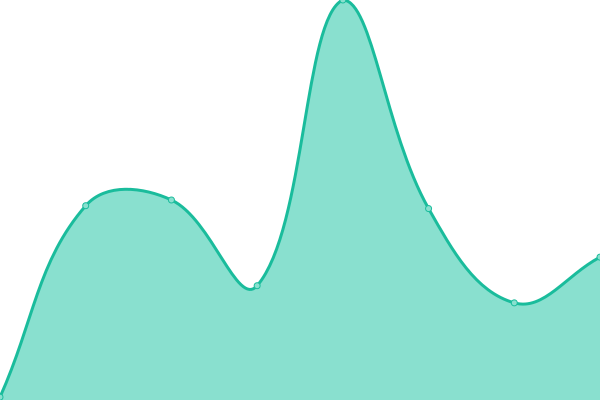
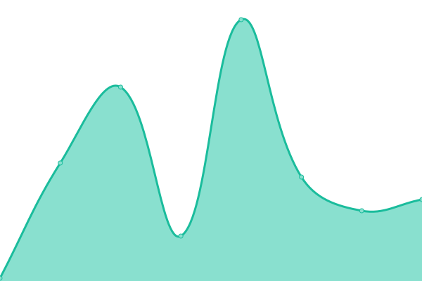
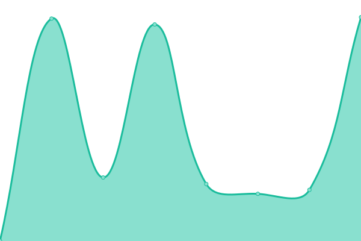
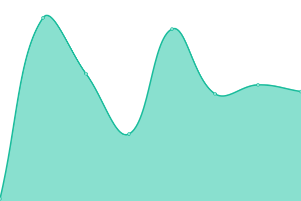
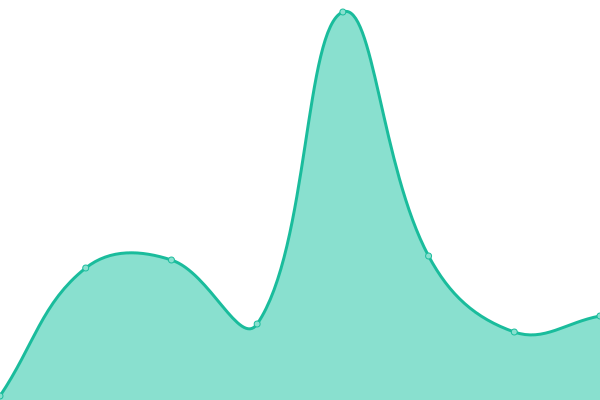
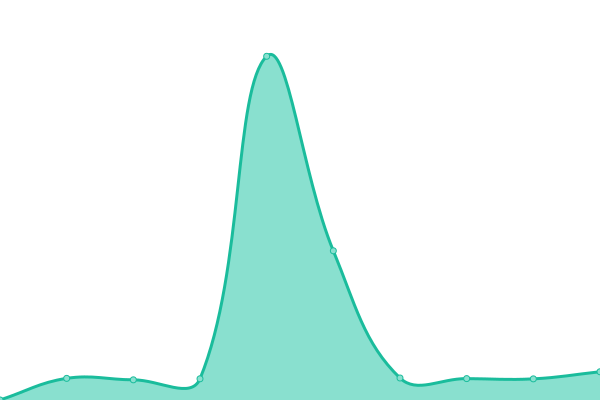
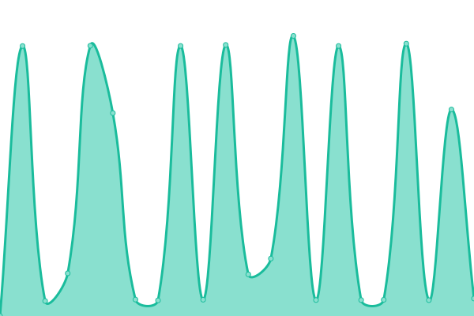

# [📈 Live Status](https://krittin-58.github.io/uptime-monitoring): <!--live status--> **🟧 Partial outage**

This repository contains the open-source uptime monitor and status page for [copter.js](https://krittin-58.github.io/uptime-monitoring), powered by [Upptime](https://github.com/upptime/upptime).

With [Upptime](https://upptime.js.org), you can get your own unlimited and free uptime monitor and status page, powered entirely by a GitHub repository. We use [Issues](https://github.com/krittin-58/uptime-monitoring/issues) as incident reports, [Actions](https://github.com/krittin-58/uptime-monitoring/actions) as uptime monitors, and [Pages](https://krittin-58.github.io/uptime-monitoring) for the status page.

<!--start: status pages-->
<!-- This summary is generated by Upptime (https://github.com/upptime/upptime) -->
<!-- Do not edit this manually, your changes will be overwritten -->
<!-- prettier-ignore -->
| URL | Status | History | Response Time | Uptime |
| --- | ------ | ------- | ------------- | ------ |
|  [Hobbies Backend](https://hobbies-backend.vercel.app) | 🟩 Up | [hobbies-backend.yml](https://github.com/krittin-58/uptime-monitoring/commits/HEAD/history/hobbies-backend.yml) | 

 1149ms
     
 | 

<a href="https://krittin-58.github.io/uptime-monitoring/history/hobbies-backend">100.00%</a>
    

|  [E-Sport Recruitment](https://esport-recruitment.vercel.app) | 🟩 Up | [e-sport-recruitment.yml](https://github.com/krittin-58/uptime-monitoring/commits/HEAD/history/e-sport-recruitment.yml) | 

 111ms
     
 | 

<a href="https://krittin-58.github.io/uptime-monitoring/history/e-sport-recruitment">100.00%</a>
    

|  [Game Compare Prices](https://peppy-llama-380c69.netlify.app) | 🟩 Up | [game-compare-prices.yml](https://github.com/krittin-58/uptime-monitoring/commits/HEAD/history/game-compare-prices.yml) | 

 131ms
     
 | 

<a href="https://krittin-58.github.io/uptime-monitoring/history/game-compare-prices">100.00%</a>
    

|  [E-Sport Tracker](https://esport-tracker-eight.vercel.app) | 🟩 Up | [e-sport-tracker.yml](https://github.com/krittin-58/uptime-monitoring/commits/HEAD/history/e-sport-tracker.yml) | 

 844ms
     
 | 

<a href="https://krittin-58.github.io/uptime-monitoring/history/e-sport-tracker">100.00%</a>
    

|  [Master Concept Examination Online](https://master-concept.vercel.app) | 🟩 Up | [master-concept-examination-online.yml](https://github.com/krittin-58/uptime-monitoring/commits/HEAD/history/master-concept-examination-online.yml) | 

 78ms
     
 | 

<a href="https://krittin-58.github.io/uptime-monitoring/history/master-concept-examination-online">100.00%</a>
    

|  [SMM Panel App](https://glittery-twilight-d3f1c7.netlify.app) | 🟩 Up | [smm-panel-app.yml](https://github.com/krittin-58/uptime-monitoring/commits/HEAD/history/smm-panel-app.yml) | 

 54ms
     
 | 

<a href="https://krittin-58.github.io/uptime-monitoring/history/smm-panel-app">100.00%</a>
    

|  [Steam Store API](https://hobbies-backend.vercel.app/steam/featured) | 🟩 Up | [steam-store-api.yml](https://github.com/krittin-58/uptime-monitoring/commits/HEAD/history/steam-store-api.yml) | 

 867ms
     
 | 

<a href="https://krittin-58.github.io/uptime-monitoring/history/steam-store-api">100.00%</a>
    

|  [PandaScore API](https://hobbies-backend.vercel.app/pandascore) | 🟩 Up | [panda-score-api.yml](https://github.com/krittin-58/uptime-monitoring/commits/HEAD/history/panda-score-api.yml) | 

 306ms
     
 | 

<a href="https://krittin-58.github.io/uptime-monitoring/history/panda-score-api">100.00%</a>
    

|  [ISS Tracker API](https://hobbies-backend.vercel.app/open-notify/iss-now) | 🟥 Down | [iss-tracker-api.yml](https://github.com/krittin-58/uptime-monitoring/commits/HEAD/history/iss-tracker-api.yml) | 

 6659ms
     
 | 

<a href="https://krittin-58.github.io/uptime-monitoring/history/iss-tracker-api">98.87%</a>
    

|  [Youtube API](https://hobbies-backend.vercel.app/youtube) | 🟩 Up | [youtube-api.yml](https://github.com/krittin-58/uptime-monitoring/commits/HEAD/history/youtube-api.yml) | 

 246ms
     
 | 

<a href="https://krittin-58.github.io/uptime-monitoring/history/youtube-api">100.00%</a>
    

<!--end: status pages-->

[**Visit our status website →**](https://krittin-58.github.io/uptime-monitoring)

## 📄 License

- Powered by: [Upptime](https://github.com/upptime/upptime)
- Code: [MIT](./LICENSE) © [Anand Chowdhary](https://anandchowdhary.com), supported by [Pabio](https://pabio.com)
- Data in the `./history` directory: [Open Database License](https://opendatacommons.org/licenses/odbl/1-0/)
